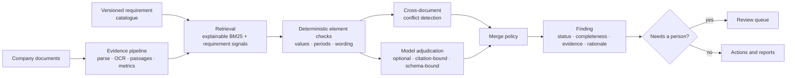
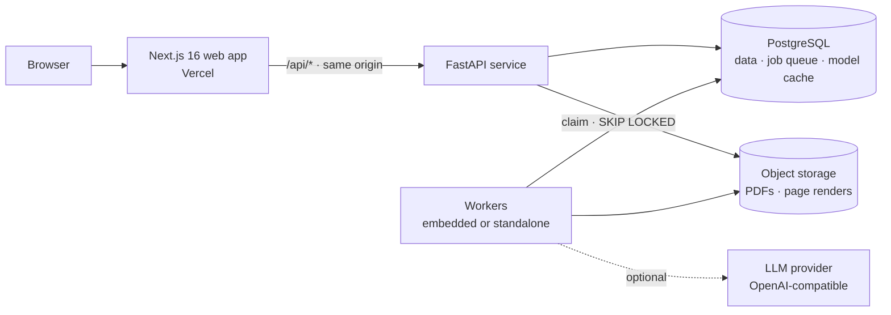

<div align="center">


# Veridion

**The evidence layer for corporate disclosure.**

Veridion reads what companies publish, tests it against the standards they report to,<br>
and backs every conclusion with the exact passage it came from.

[Website](https://veridion-nine.vercel.app) · [Interactive demo](https://veridion-nine.vercel.app/demo) · [Methodology](https://veridion-nine.vercel.app/methodology) · [Security](https://veridion-nine.vercel.app/trust/security) · [Architecture](docs/architecture.md)

[](https://github.com/ChethanKMurthy/veridion/actions/workflows/ci.yml)


</div>

---

## Contents

- [Overview](#overview)
- [Why now](#why-now)
- [What Veridion delivers](#what-veridion-delivers)
- [How Veridion reasons](#how-veridion-reasons)
- [Architecture](#architecture)
- [Quality and evaluation](#quality-and-evaluation)
- [Deployment](#deployment)
- [Getting started](#getting-started)
- [Engineering practices](#engineering-practices)
- [Business model](#business-model)
- [Roadmap](#roadmap)
- [Documentation](#documentation)

## Overview

Sustainability and annual reports run to hundreds of pages, and the standards they are judged against change every year. Proving what a report actually says (which requirements are evidenced, which are missing, where two documents disagree) is still done by hand, in spreadsheets that record conclusions but not their proof.

Veridion automates that work without asking anyone to trust a black box. It ingests a company's documents, extracts the facts that matter, assesses them against versioned requirement catalogues, and produces findings in which every conclusion links to the page, passage and figure that supports it. Where evidence is thin, contradictory or ambiguous, Veridion says so and routes the question to a person.

**Built for**

- **Sustainability advisory firms** running disclosure-readiness and gap assessments across many client engagements.
- **Corporate reporting teams** preparing emissions and energy disclosures for a reporting cycle or a standard transition.
- **Investment and credit research teams** comparing disclosures across portfolios (on the roadmap).

> Veridion is in early access. The [interactive demo](https://veridion-nine.vercel.app/demo) runs the production engine on fictional companies, and you can [open a workspace](https://veridion-nine.vercel.app/sign-up) for your own documents.

## Why now

| Shift | Consequence |
|---|---|
| **The rulebook is being rewritten.** GRI 102: Climate Change 2025 and GRI 103: Energy 2025 take effect on 1 January 2027, withdrawing GRI 305-1 to 305-5 and replacing GRI 302. The European Commission adopted revised ESRS on 3 July 2026 for financial years from 1 January 2027, subject to scrutiny. | Checklists built for the previous standards go stale. Every reporter must re-map its disclosures, requirement by requirement, version by version. |
| **Disclosures are now assured.** Sustainability statements under the CSRD are subject to external assurance. | Each reported figure needs a traceable source, and contradictions between documents must be caught before an assurer finds them. |
| **Generic AI is fast but unauditable.** Summaries without verifiable citations cannot be signed off. | The advantage goes to systems that constrain models to evidence and make every inference checkable. |

Sources: [GRI 102](https://www.globalreporting.org/publications/documents/english/gri-102-climate-change-2025/), [GRI 103 FAQ](https://www.globalreporting.org/media/mead5ytn/gri-103-energy-2025-frequently-asked-questions-faqs.pdf), [Cooley on the revised ESRS](https://www.cooley.com/news/insight/2026/2026-07-21-european-commission-adopts-revised-eu-csrd-reporting-standards), [EY](https://www.ey.com/en_gl/technical/csrd-technical-resources/eu-adopts-revised-esrs-for-sustainability-reporting).

## What Veridion delivers

| Capability | What it gives your team |
|---|---|
| **Evidence Explorer** | Every requirement with its status, weighted coverage and cited passages. Open any finding to follow its evidence trail from requirement to source page to remediation. |
| **Contradiction detection** | The same metric reported differently across documents, after unit and period normalisation, is surfaced with both sources side by side and never silently reconciled. |
| **Versioned requirement intelligence** | Requirements live in versioned catalogues with effective dates. Each assessment records the exact version it used, so standards can change without rewriting history. |
| **Remediation planning** | Gaps become owned, dated actions ranked by importance × gap × urgency, and close themselves when a later assessment shows the gap resolved. |
| **Peer intelligence** | Disclosure benchmarks with explicit comparability notes for period, boundary, method and unit. "Not disclosed" is never treated as zero. |
| **Audit-ready history** | Immutable assessment runs with input manifests, run-to-run diffs that explain why each finding changed, and exports as a report, CSV or JSON. |

## How Veridion reasons

Veridion is a hybrid reasoning system. Deterministic evidence checks decide everything that can be decided exactly; a language model adjudicates only what needs judgment, inside guardrails that make its contribution verifiable.



Every finding carries one of five statuses with a precise meaning:

| Status | Meaning |
|---|---|
| Supported | Every applicable element of the requirement is evidenced by a cited passage. |
| Partially supported | Some elements are evidenced; the missing ones are named. |
| Not found | No element is evidenced in the documents provided. |
| Conflicting | The documents report materially different values for the same metric and period. |
| Needs review | The evidence needs human judgment, for example low-confidence OCR or a sharp disagreement between rules and model. |

### Guarantees

| Guarantee | How it is enforced |
|---|---|
| Every finding is traceable | Passages carry deterministic IDs (a hash of document, page, position and text) and page coordinates. Findings link to them through an explicit evidence table, so citations survive reprocessing. |
| The model cannot invent evidence | It sees at most 12 candidate passages and may cite only their IDs. Any other citation is discarded and the finding flagged. Output is requested in a strict JSON schema and validated field by field: unknown statuses become *needs review*, and unknown elements are dropped. |
| Numbers are never decided by a language model | Values, units and periods are rules-authoritative. If the model disagrees, the finding is routed to review instead of being changed. |
| Contradictions are never resolved automatically | Values for one metric and period that differ by more than 1% after normalisation make a finding *conflicting*, and no model output can override it. |
| Results are reproducible | Each run stores document hashes, the catalogue's content hash and the pipeline, extraction, rules and prompt versions. Model responses are cached by a hash of model, prompt version and inputs. |
| Absence of evidence is not non-compliance | Statuses describe the documents provided, and the product says so wherever they appear. |
| Tenants are isolated | Every row is scoped to an organisation. A request for another tenant's record returns 404, and isolation is covered by tests. |

### Scoring

- **Completeness** is the weighted share of a requirement's applicable elements that are evidenced: `C = Σ wᵢ·sᵢ / Σ wᵢ`.
- **Remediation priority** is `P = I × G × U`: catalogue importance, gap size (1 − C for partial findings; fixed weights for not found, conflicting and needs review) and deadline urgency. All three components are stored and shown, so every ranking can be explained.

The complete rule set, including the model merge policy, is documented in [docs/methodology.md](docs/methodology.md).

## Architecture



| Layer | Technology | Responsibility |
|---|---|---|
| Web | Next.js 16 (App Router, Cache Components, partial prerendering), React 19, Tailwind CSS 4, SWR | Marketing site, public demo and the authenticated workspace. Browsers only ever talk to this origin; `/api/*` is proxied, so sessions stay first-party. |
| API | Python 3.12, FastAPI, Pydantic 2, SQLAlchemy 2 | Authentication, tenancy, documents, assessments, reviews, actions, benchmarks and exports. Stateless and horizontally scalable. |
| Workers | Same package (`veridion worker`), or embedded in the API | Document processing and assessment runs, claimed from a PostgreSQL-backed queue. |
| Data | PostgreSQL 17 (SQLite for development and tests), Alembic | All state, including the job queue and the model-response cache. |
| Files | Local volume or any S3-compatible store | Original PDFs and rendered page images, private to their organisation. |
| Models | Any OpenAI-compatible endpoint; Groq-hosted `openai/gpt-oss-120b` by default | Optional adjudication. The product is fully functional without a model. |

### Evidence pipeline

1. **Intake.** File signature and size checks, plan limits, and SHA-256 content addressing. A duplicate of a current document is rejected; re-uploading a file whose stored copy was lost restores it in place.
2. **Parsing.** PyMuPDF text with positions and NFKC normalisation. Ruled tables are split into rows, so each row becomes a citable passage.
3. **OCR.** Pages without a usable text layer are rendered at 300 DPI and read with Tesseract. Recognition confidence is carried on every passage, and evidence that rests on low-confidence text is routed to review.
4. **Layout cleanup.** Running headers and footers that repeat across pages are removed before segmentation.
5. **Passages.** Headings, paragraphs and table rows, each with page, bounding box, section path and a deterministic ID.
6. **Metric extraction.** Emissions (Scope 1, Scope 2 location- and market-based, Scope 3, totals and intensities), energy, water and waste. Units are normalised within each family (tCO2e, MWh, m³, t; 1 MWh = 3.6 GJ), scale words such as thousand, million, lakh and crore are understood, and periods are aligned to the company's fiscal year with comparatives and base years kept apart.

### Assessment engine

| Stage | Implementation |
|---|---|
| Retrieval | BM25 (k1 = 1.4, b = 0.75) with phrase, metric and section boosts. Each hit records why it matched. |
| Element checks | A typed check language in the catalogue: `metric`, `metric_period`, `pattern` (with context terms), `any_of` and `conditional`. Catalogue versions are immutable once used. |
| Conflict detection | Every extracted value for the requirement's metrics and period is compared after normalisation, with a 1% tolerance. |
| Model adjudication | Per-requirement review at temperature 0 against at most 12 passages, with strict JSON-schema output, a rate gate driven by the provider's rate-limit headers, retries and a per-requirement fallback to rules. |
| Merge policy | Fixed rules decide when the model may correct a wording element, when disagreement routes to review, and why it can never touch values or conflicts. Every override is recorded with its reason. |
| Change intelligence | Runs are never edited. Diffs attribute every changed finding to a revised catalogue, changed documents or a different method; findings that cite replaced documents are marked stale. |

### Platform services

- **Tenancy and access.** Organisation-scoped data; owner, admin, analyst, reviewer and viewer roles; role checks on every write.
- **Authentication.** scrypt password hashing (N = 2¹⁵), a signed `HttpOnly`, `SameSite=Lax` session cookie (`Secure` over HTTPS), a client header that blocks cross-site request forgery on cookie-authenticated writes, and bearer tokens for programmatic clients.
- **Abuse controls.** Sliding-window limits on sign-in (per address and per account), registration and enquiries; client addresses resolved only through trusted proxies.
- **Entitlements and metering.** Plan limits on companies, documents, pages, assessment runs and model-assisted runs, with usage recorded per organisation.
- **Job system.** A PostgreSQL queue claimed with `FOR UPDATE SKIP LOCKED`, exponential-backoff retries, recovery of jobs held by dead workers, and graceful shutdown on `SIGTERM`. Advisory locks serialise migrations and catalogue loading when instances start together.
- **Observability.** Request IDs on every response, per-job logs with duration and outcome, liveness and readiness endpoints, and an append-only audit log of security-relevant events.

### Web application

- Static, prerendered marketing and research pages, and an authenticated client workspace under `/app`.
- A `DataClient` abstraction with two implementations: `HttpClient` for live workspaces and `SnapshotClient`, which replays recorded engine output to power the public demo with no backend or account.
- Container-query layouts, so the Evidence Explorer adapts to the space it actually has (beside the evidence trail, on a tablet or on a phone) rather than to the viewport.
- Built to WCAG 2.2 AA targets: status glyphs encode meaning by shape as well as colour, full keyboard navigation, and reduced-motion support.

Deeper reference: [docs/architecture.md](docs/architecture.md).

## Quality and evaluation

Veridion is developed against a labelled benchmark. Extraction, rules and prompts are measured with `make eval`, and results are published together with their failures.

| Metric | Rules (139 cases) | Rules + model (45-case sample) |
|---|---|---|
| Status accuracy, five classes | 89.9% | 93.3% |
| Gap detection recall | 97.1% | 100% |
| Element recall | 89.5% | 96.6% |
| Contradiction detection, precision / recall | 100% / 100% | 100% / 100% |
| Retrieval recall@5 | 100% | 100% |
| Evidence-support precision | 75.1% | 76.5% |
| Numeric extraction accuracy | 96.5% (86 values) | 100% (31 values) |
| Citation validity | 100% (454 citations) | 100% (192 citations) |

The benchmark combines 27 hand-labelled cases on a reference corpus with 112 synthetic cases built from paraphrases, absent disclosures and adversarial traps such as base-year figures and component rows. It is being extended with permissioned real-world documents. Full results: [docs/evaluation.md](docs/evaluation.md) and [docs/evaluation-rules-full.md](docs/evaluation-rules-full.md).

### Performance and unit economics

| Measure | Result |
|---|---|
| Rules-only assessment, 9 requirements | about 20 ms of compute |
| Document processing, 3–7 page report including a scanned page | 0.2–0.5 s |
| Model-assisted assessment, 9 requirements | about 15.7k input and 5.7k output tokens, roughly US$0.007 at Groq's published launch price for `openai/gpt-oss-120b` |
| Re-running an unchanged assessment | served from the response cache at no model cost |

Inference cost grows linearly with catalogue size, to roughly US$0.08 for a 100-requirement catalogue. At any plausible subscription price compute is a rounding error; cost of goods is driven by catalogue curation and onboarding.

## Deployment

| Tier | Platform | Notes |
|---|---|---|
| Web | Vercel ([veridion-nine.vercel.app](https://veridion-nine.vercel.app)) | Static pages from the edge; `/api/*` proxied to the API on the same origin. |
| API and workers | Any container platform; a Render Blueprint (`render.yaml`) is included | One image runs the API, workers and migrations. `veridion serve --migrate` applies migrations under an advisory lock on hosts without a release step. |
| Database | PostgreSQL 16 or 17 | Alembic migrations, drift-checked in CI. |
| Files | Local volume or any S3-compatible bucket | Private, content-addressed, restorable by re-upload. |

The full stack also runs on one machine with Docker Compose: PostgreSQL, a one-shot migration, the API, a worker and the web app. Configuration, scaling, releases, monitoring, backups and a production checklist are in [docs/deployment.md](docs/deployment.md).

## Getting started

Prerequisites: Python 3.12 with [uv](https://docs.astral.sh/uv/), Node.js 22 or later, and optionally Tesseract for scanned PDFs.

```bash
cp .env.example .env        # rules-only by default; add GROQ_API_KEY for model-assisted runs
make setup                  # install API and web dependencies
make seed MODE=rules        # create the sample workspace: demo@veridion.example / veridion-demo
make dev                    # API on :8000 with an embedded worker, web on :3000
```

Open http://localhost:3000. The OpenAPI reference is served at http://localhost:3000/api/docs.

Production-shaped stack:

```bash
# .env: SECRET_KEY=$(python -c "import secrets; print(secrets.token_urlsafe(48))") and POSTGRES_PASSWORD
docker compose up --build --detach
docker compose run --rm api veridion seed demo --mode rules
```

`make help` lists every command.

### Repository layout

```
apps/
  api/                     Python package `veridion`
    src/veridion/
      api/                 HTTP layer: routers, auth, roles, rate limits, error mapping
      pipeline/            PDF parsing, OCR, tables, passages
      extraction/          Values, units, scale words, periods
      retrieval/           Explainable BM25 retrieval
      catalog/             Versioned requirement catalogues: loading and validation
      assessment/          Rules, model adjudication, merge policy, priorities, diffs, actions
      benchmarking/        Peer comparison with comparability notes
      llm/                 Provider gateway: rate gate, retries, response cache
      jobs/                PostgreSQL-backed queue and worker
      services/            Documents, entitlements, usage metering, audit
      eval/                Labelled benchmark and evaluation runner
    catalog/               Requirement catalogues (YAML)
    migrations/            Alembic migrations
    tests/                 pytest suite
  web/
    src/app/               Routes: marketing, auth, workspace (/app), demo (/demo)
    src/components/        Workspace screens, Evidence Explorer, design-system primitives
    src/lib/api/           DataClient: live HTTP and recorded-snapshot implementations
docs/                      Architecture, methodology, deployment, evaluation, strategy
docker-compose.yml · render.yaml · Makefile · .github/workflows/ci.yml
```

## Engineering practices

- **Continuous integration on every push.** The API job runs Ruff and the 67-test suite (with Tesseract), then applies and drift-checks migrations on PostgreSQL 17 and runs the platform end to end against it. The web job runs ESLint, strict TypeScript and a production build. A final job builds both container images and smoke-tests the full stack through the web origin.
- **Tests cover the contracts that matter:** tenant isolation, roles, CSRF and bearer authentication, rate limits, plan limits, the full upload-to-report workflow, exports, the model merge policy, extraction edge cases, OCR and file recovery.
- **Schema changes ship as reviewed migrations,** and CI fails if models and migrations drift apart.
- **Invariants live in code, not convention:** immutable catalogue versions, deterministic evidence IDs, validated model output, and no silent model overrides.

## Business model

- **Subscription per organisation,** scaled by client companies, documents and model-assisted runs. Entitlements and usage metering are built into the platform.
- **Plans:** Explorer (free), Professional and Enterprise.
- **Margin profile:** inference costs well under a cent per model-assisted assessment, so gross margin is set by onboarding and catalogue curation, both of which get cheaper per customer as the catalogue library grows.

**Defensibility compounds with use:** curated requirement catalogues with element-level checks; labelled evaluation data drawn from permissioned engagements; longitudinal evidence across companies and periods with full provenance; and review, action, history and export workflows that teams rely on every reporting cycle. Strategy and go-to-market: [docs/business-plan.md](docs/business-plan.md).

## Roadmap

Current coverage: GRI energy and emissions disclosures (GRI 302 and 305 reviewed; GRI 102 and 103 in draft), assessed from English-language PDF reports.

| Horizon | Focus |
|---|---|
| **Now** | Design-partner pilots with sustainability advisory firms; GRI 102 and GRI 103 (2025) catalogues from draft to reviewed; a real-world labelled evaluation set. |
| **Next** | Revised ESRS and IFRS S2 catalogues; client-ready evidence packages; SSO (SAML and OIDC); shared rate limiting and a managed job broker for multi-instance scale. |
| **Later** | A longitudinal company evidence graph across periods and peers; API access for data partners; assurance-ready approval and sign-off workflows. |

## Documentation

| Document | Covers |
|---|---|
| [Methodology](docs/methodology.md) | Statuses, element checks, conflicts, the model merge policy, priorities, benchmarking |
| [Architecture](docs/architecture.md) | Components, data model, security model, scaling path |
| [Deployment](docs/deployment.md) | Vercel and Render, Docker, configuration, releases, monitoring, backups |
| [Evaluation](docs/evaluation.md) | Benchmark results, rules vs rules + model, failure analysis |
| [Strategy](docs/business-plan.md) | Customer, positioning, pricing hypotheses, unit economics, risks |
| [Product principles](PRODUCT.md) · [Design system](DESIGN.md) | Product principles, tone and the visual system |
| [Security policy](SECURITY.md) | Vulnerability reporting and controls |

## Contact

Product, partnership and investment enquiries: [veridion-nine.vercel.app/contact](https://veridion-nine.vercel.app/contact). Security reports: see [SECURITY.md](SECURITY.md).

## License

Proprietary software. All rights reserved.
