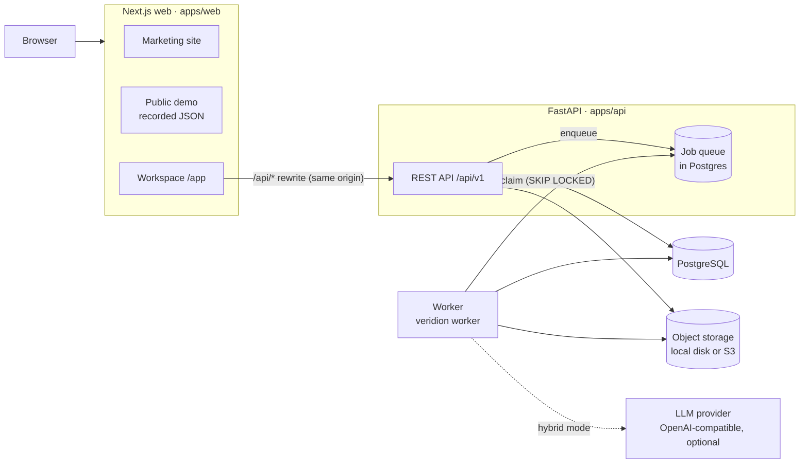
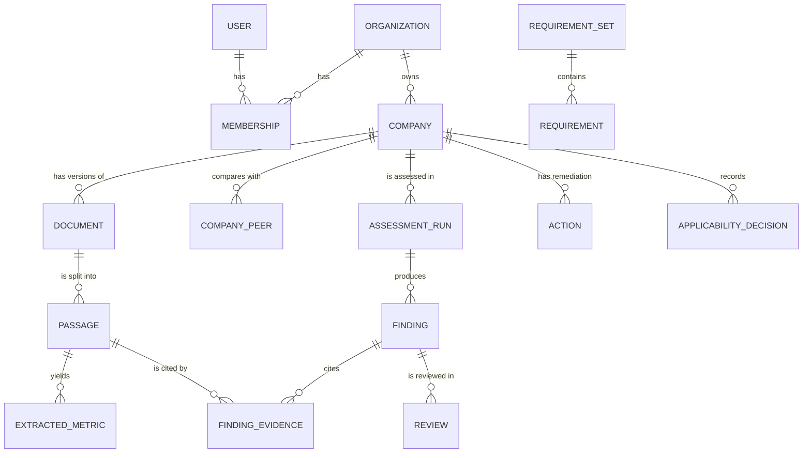

# Architecture

Veridion turns company documents into findings that can be traced back to the passages that support them. This document describes how the system is built, why it is built that way, and how it scales. For the assessment rules themselves see [methodology.md](methodology.md); for running it in production see [deployment.md](deployment.md).

## System overview



| Component | Technology | Responsibility |
|---|---|---|
| Web | Next.js 16 (App Router, Cache Components), React 19, Tailwind CSS 4, SWR | Marketing site, public demo, authenticated workspace. Proxies `/api/*` to the API so session cookies stay first-party. |
| API | FastAPI, Pydantic 2, SQLAlchemy 2 | Authentication, tenancy, CRUD, assessment orchestration, exports. Stateless; scale horizontally. |
| Worker | Same Python package (`veridion worker`) | Document processing (parse, OCR, extract) and assessment runs. Scale horizontally. |
| Database | PostgreSQL in production, SQLite in development and tests | All state, including the job queue and the model-response cache. Schema managed with Alembic. |
| Storage | Local filesystem or any S3-compatible store | Original PDFs and rendered page images. |
| Model provider | Any OpenAI-compatible endpoint (Groq by default) | Optional second opinion on each requirement. The product works without one. |

The same container image runs the API, the worker and migrations, so a release is one image tag.

## Repository layout

```
apps/
  api/                       Python package `veridion`
    src/veridion/
      api/                   FastAPI routers, dependencies (auth, roles, rate limits), serializers
      pipeline/              PDF parsing, OCR, table detection, passage segmentation
      extraction/            Deterministic metric extraction (values, units, periods)
      retrieval/             BM25 retrieval with requirement-aware boosts and explanations
      catalog/               Versioned requirement catalogue loader and validator
      assessment/            Rules engine, model assessment, merge policy, priorities, diffs, actions
      benchmarking/          Peer comparison with comparability notes
      llm/                   OpenAI-compatible provider, rate gate, response cache
      jobs/                  Database-backed job queue and worker loop
      services/              Documents, entitlements, usage metering, audit log
      storage/               Local and S3 storage backends
      eval/                  Labelled evaluation dataset and runner
      samples/               Fictional sample companies and PDF generator
      reports/               Report and export rendering
      models/                SQLAlchemy models
    catalog/                 Requirement catalogues (YAML, one directory per set)
    migrations/              Alembic migrations
    tests/                   pytest suite
  web/
    src/app/                 Routes: (site) marketing, (auth), app (workspace), demo
    src/components/          site/, app/ (workspace screens), ui/ (primitives)
    src/lib/api/             Data client abstraction: HttpClient (live) and SnapshotClient (demo)
    public/demo/             Recorded API responses and page images for the public demo
docs/                        Architecture, methodology, deployment, evaluation, business plan
```

## Data model



Supporting tables: `audit_events`, `usage_events`, `enquiries`, `jobs`, `llm_cache`.

Design decisions that matter:

- **Every tenant-owned row carries `org_id`.** Queries are always scoped by the caller's organization, and a foreign identifier returns 404, not 403, so identifiers do not leak across tenants.
- **Documents are versioned, never overwritten.** A replacement creates a new version in the same lineage (`lineage_id`) and marks the old one `superseded`. Findings that cite a superseded version are flagged as stale rather than silently changing.
- **Evidence identifiers are deterministic.** A passage ID is derived from a hash of the document, page, position and text, so re-processing the same file produces the same IDs and citations stay valid.
- **Runs are immutable records.** An assessment run stores a manifest of document hashes, catalogue version and content hash, and the pipeline, extraction, rules and prompt versions. Re-running never edits an old run; it creates a new one that can be compared with it.
- **Requirement catalogues are versioned files.** Sets are validated with Pydantic on load, identified as `key@version`, and become immutable once a run has used them (a changed file with the same version is rejected).
- **Portable types.** JSON columns use `JSONB` on PostgreSQL and `JSON` elsewhere; timestamps are timezone-aware UTC on both backends.

## Request and job flow

1. **Upload.** The API checks the file signature, size and plan limits, rejects a file that is already a current document of the same company (by SHA-256), stores the PDF, and enqueues a `process_document` job.
2. **Process.** A worker claims the job, parses the PDF with PyMuPDF, runs Tesseract on pages without a usable text layer, removes running headers and footers, splits text and tables into passages, and extracts metrics. Progress is reported for the UI.
3. **Assess.** Creating a run validates the catalogue, period and quota, then enqueues `run_assessment`. The worker loads the company's current documents, runs the rules engine for each requirement, optionally asks the model for a second opinion in parallel, merges the two by a fixed policy, and writes findings, evidence links and remediation actions in one transaction.
4. **Review.** Analysts accept, override or comment on findings; reviews never rewrite the original finding. Actions persist across runs and close themselves when a later run no longer shows the gap.

The queue lives in the database: jobs are claimed with `SELECT … FOR UPDATE SKIP LOCKED` on PostgreSQL (an optimistic update on SQLite), retried with backoff, and re-queued if a worker dies while holding one. This avoids a separate broker until volume justifies one. Workers stop gracefully on `SIGTERM`, finishing the current job.

## Assessment engine

The engine is deliberately layered so that the deterministic part stands on its own:

| Layer | What it does | Deterministic |
|---|---|---|
| Extraction | Values, units and periods from text and tables; unit families normalised (tCO2e, MWh, m³, t); scale words such as thousand, million, lakh and crore | Yes |
| Retrieval | BM25 over passages, plus phrase, metric and section boosts; each hit records why it matched | Yes |
| Rules | Each requirement element is a typed check (`metric`, `metric_period`, `pattern`, `any_of`, `conditional`); completeness is the weighted share of satisfied elements; cross-source values that differ by more than 1% are conflicts | Yes |
| Model (optional) | Reviews each requirement against at most 12 candidate passages, answers in a strict JSON schema, may cite only the passages it was given | No (temperature 0, cached) |
| Merge | Numbers and periods stay rules-authoritative; wording elements can be corrected by the model with valid citations; detected conflicts can never be overridden; disagreements route to human review | Yes |

Model responses are cached by a hash of model, prompt version and inputs, so re-running an unchanged assessment is free and reproducible. Every citation the model returns is validated against the candidate set; invalid ones are discarded and the finding is flagged.

## Web application

- **Rendering.** Marketing pages are static and prerendered. The workspace is a client application under `/app` that talks to the API through the same origin.
- **Data access.** Screens use SWR through a small `DataClient` interface with two implementations: `HttpClient` for the live workspace and `SnapshotClient` for the public demo, which reads recorded API responses from `public/demo/api/`. The demo therefore runs the real screens on real engine output, without a backend or an account.
- **Authentication.** A `proxy.ts` check redirects visitors without a session cookie away from `/app` (an optimistic check only; the API authorises every request).
- **Layout.** The Evidence Explorer uses container queries, so it switches between a table and a stacked list based on the room it actually has (beside the evidence trail, or on a phone) rather than the viewport.

## Security model

| Control | Implementation |
|---|---|
| Passwords | scrypt with per-user salt; constant-time comparison; dummy verification for unknown emails |
| Sessions | HS256 JWT in an `httpOnly`, `SameSite=Lax` cookie, marked `Secure` when `COOKIE_SECURE=true` (production warns at startup if it is not); bearer tokens also accepted for API clients |
| CSRF | Cookie-authenticated writes require the `X-Veridion-Client: web` header, which browsers cannot send cross-site without CORS approval |
| Authorisation | Roles owner, admin, analyst, reviewer, viewer; route-level role checks; every query scoped by organization |
| Abuse limits | Sliding-window limits on login (per address and per account), registration and enquiries; plan quotas on companies, documents, pages and runs |
| Client addresses | `X-Forwarded-For` is honoured only from proxies in `FORWARDED_ALLOW_IPS` |
| Audit | Sign-ins and failed sign-ins, membership, role and plan changes, uploads, deletions, assessments, applicability decisions and exports are logged with the actor; reviews keep their own append-only history |
| Uploads | PDF signature and size checks, page limits per plan, duplicate detection by content hash; files are served only to members of the owning organization |
| Model use | Passages are passed as data, not instructions; the model can only cite supplied passage IDs; it cannot change numeric findings or conflicts |
| Secrets | Settings from environment variables; production refuses to start without `SECRET_KEY` |
| HTTP | Security headers on both apps; request IDs on every API response |

## Scaling path

The current shape (one database, stateless API processes, horizontally scalable workers, object storage) carries a long way. Expected steps as usage grows:

| Stage | Trigger | Change |
|---|---|---|
| Today | Pilot customers | One PostgreSQL instance, 1–2 API containers, 1+ workers, S3-compatible storage. Docker Compose or any container platform. |
| More tenants | Several API instances | Move rate limiting from in-process memory to Redis (the limiter has one interface, `RateLimiter.check`). Use managed PostgreSQL with automated backups. |
| Larger documents and catalogues | Worker CPU saturation | Add workers; OCR and parsing are CPU-bound and parallelise per document. Split document processing and assessment onto separate worker pools if one starves the other. |
| Heavy job volume | Queue contention in PostgreSQL | Replace the job table with a broker (SQS, Redis streams) behind the same `enqueue`/handler interface. |
| Cross-document search at scale | Many documents per tenant | Move retrieval candidates to PostgreSQL full-text search or a search service; add embeddings only if the evaluation suite shows retrieval gains. |
| Enterprise | Security reviews | SSO (SAML/OIDC), per-tenant encryption keys, data residency, SOC 2 controls; the audit log and tenancy model are already in place. |

Known limitations today:

- Rate limits and live job progress are held in memory per process; progress is also written to the database on a best-effort basis.
- The web image fixes the API address at build time (Next.js rewrites are compiled into the build).
- Page images are rendered on demand and cached in storage; very large documents render their first view slowly.
- Catalogues cover a focused subset of GRI disclosures (see [methodology.md](methodology.md)).
